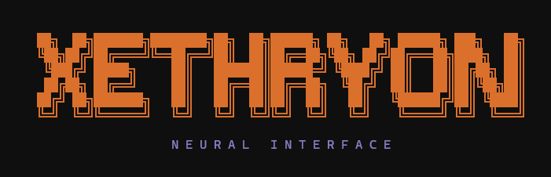
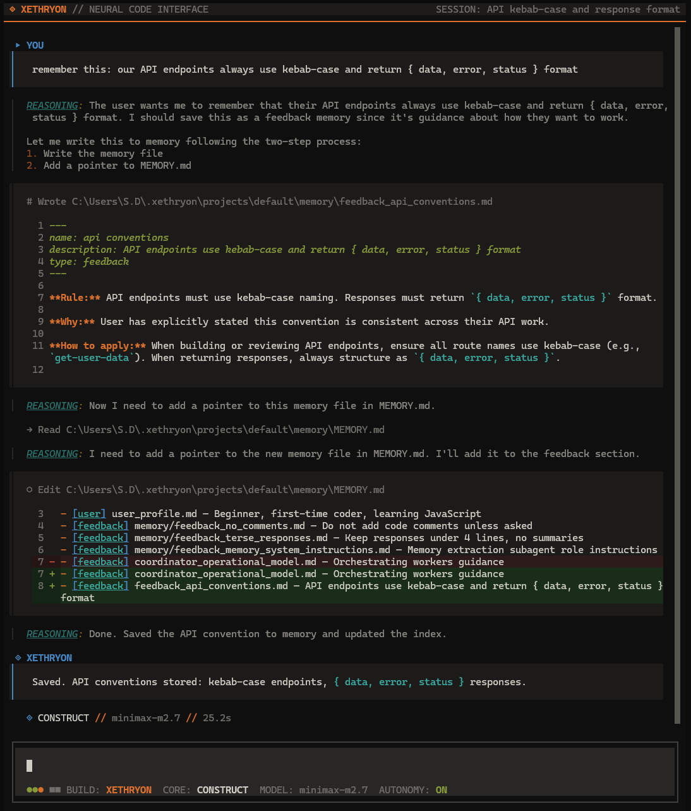
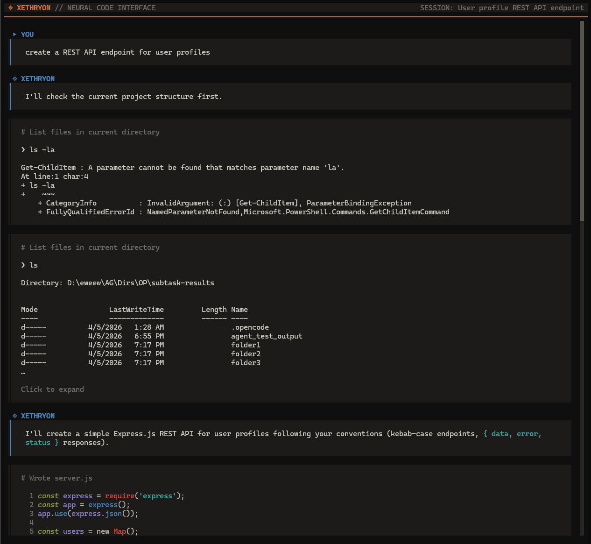
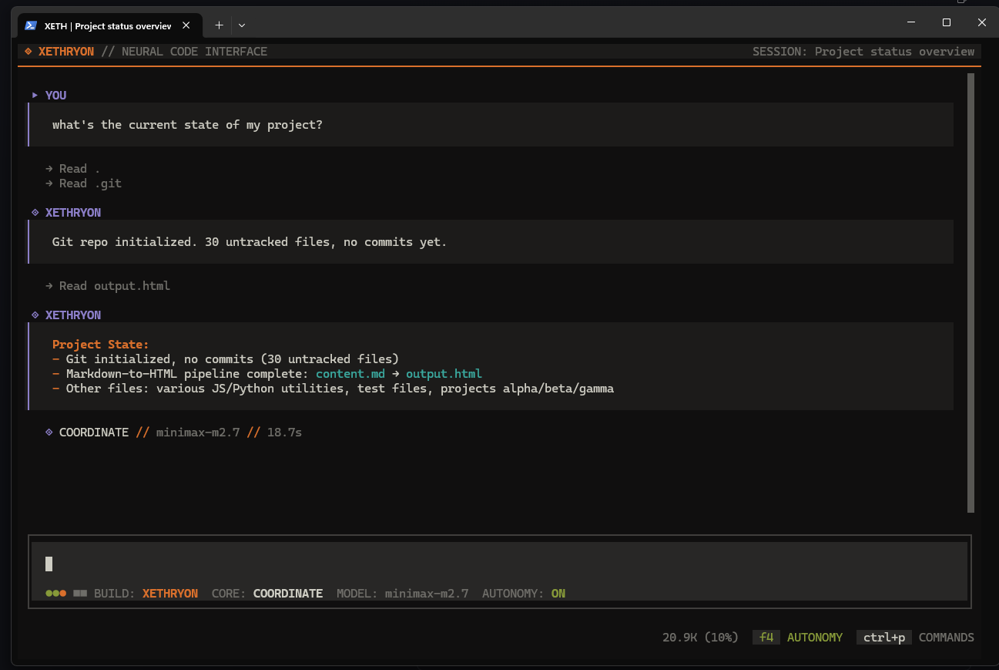
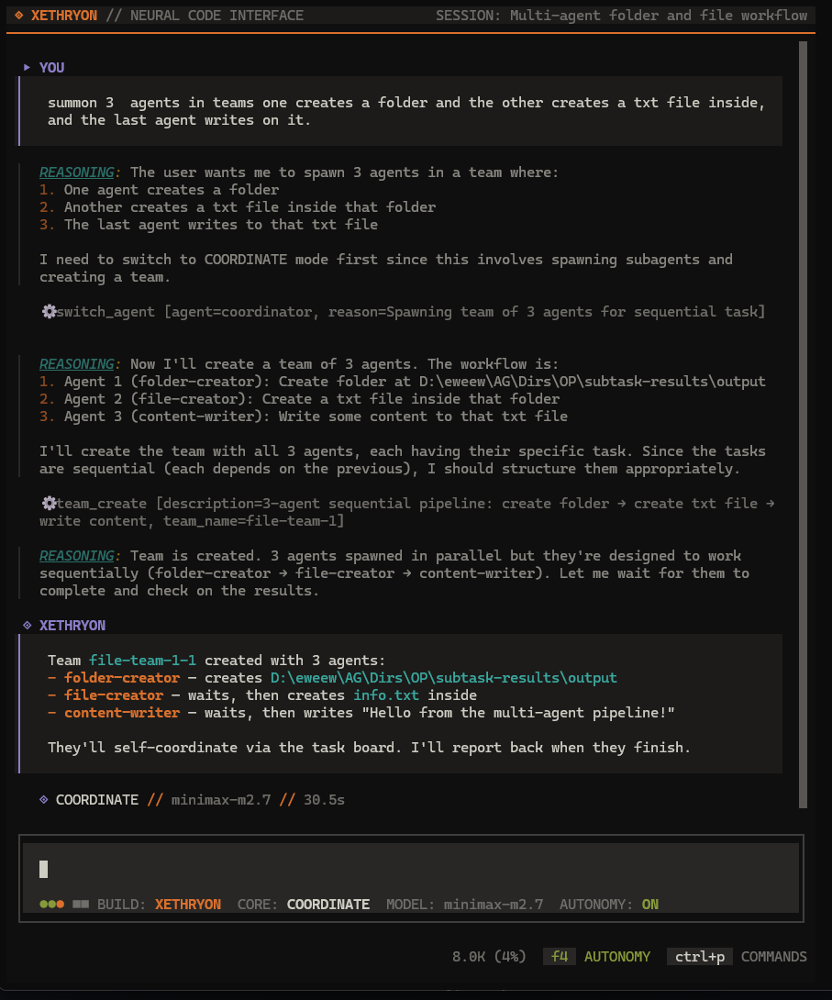
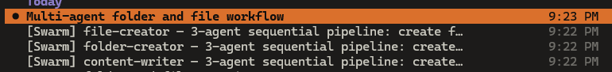
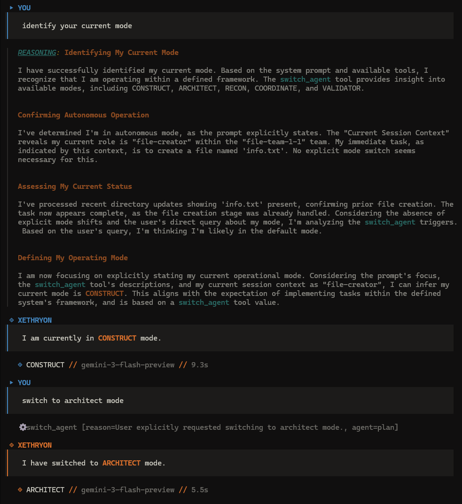

<p align="center">
  
</p>

A terminal-based AI coding agent. Fork of [OpenCode](https://opencode.ai) with selective features ported from Anthropic's [Claude Code](https://github.com/anthropics/claude-code) leak, plus custom additions for memory retrieval, self-reflection, git awareness, and autonomous skill invocation.

---

## Features

### Persistent Project Memory
The agent extracts learnings from every conversation and stores them as durable memory files. On subsequent sessions, relevant memories are retrieved automatically based on the current query — no manual context loading required.

- Post-turn extraction of key facts and patterns
- LLM-ranked retrieval (not keyword matching)
- AutoDream consolidation after 24h or 5 sessions
- Stored at `~/.xethryon/projects/<project>/memory/`

**Session 1** — teaching a convention:



**Session 2** — new chat, recalls it without being reminded:



### Self-Reflection
Before presenting code to the user, the agent reviews its own output: did it address the actual request, are there missing edge cases, does it follow existing patterns. If issues are found, it revises silently — the user only sees the corrected result.

Capped at one reflection pass per turn. Toggle with `XETHRYON_REFLECTION=0`.

### Git-Aware Context
The agent sees branch name, uncommitted changes, merge/rebase state, and ahead/behind counts without running explicit commands. This informs decisions about stashing, branching, and conflict handling.

Toggle with `XETHRYON_GIT_AWARE=0`.



### Autonomy Mode (`F4`)
When enabled, the agent operates with more initiative.

**Agent switching** — the agent reads task intent and pivots between modes automatically:

```
"plan a refactor of the auth module"     → switches to ARCHITECT
"explore how the payment system works"   → switches to EXPLORE
"create a team to fix these 5 bugs"      → switches to COORDINATE
"verify the test suite passes"           → switches to VALIDATE
planning done, time to implement         → switches back to CONSTRUCT
```

**Skill invocation** — after completing code tasks, the agent considers invoking follow-up skills on its own:

- Wrote/modified code → invoke `/verify`
- Learned a project pattern → invoke `/remember`
- Task complete → invoke `/pr`
- Something failed → invoke `/debug`

This can chain: a single prompt can result in planning, implementation, verification, and shipping without manual steps in between.

### Swarm Orchestration
Parallel workflows via isolated sub-sessions with file-based IPC and shared task boards.

Tools: `team_create`, `team_delete`, `send_message`, `task_create`, `task_get`, `task_update`, `task_list`, `task_stop`.





### Agent Modes

Switch manually with `Tab` or let autonomy handle it.



| Mode | Codename | Purpose |
|------|----------|---------|
| Build | `CONSTRUCT` | Full-access code implementation |
| Plan | `ARCHITECT` | Read-only architectural analysis |
| Manage | `COORDINATE` | Multi-agent team orchestration |
| Search | `EXPLORE` | Codebase exploration and research |
| Review | `VALIDATE` | Test validation and code review |

### Provider Support
Bring your own keys. Works with Anthropic, OpenAI, Google, OpenRouter, MiniMax, and local models.

### Theme
Ships with a dark Cyberpunk-inspired color palette. Editable via `packages/opencode/src/cli/cmd/tui/context/theme/xethryon.json` — no recompilation needed.

---

## Install

### Quick Install (Windows)

```powershell
irm https://raw.githubusercontent.com/EstarinAzx/XETHRYON/xethryon/install.ps1 | iex
```

Downloads the latest release binary, puts it in `%LOCALAPPDATA%\xethryon\bin`, and adds it to your PATH.

### Prerequisites (building from source)

- [Bun](https://bun.sh) (v1.1+)
- Git
- An LLM API key (OpenRouter, Anthropic, OpenAI, Google, etc.)

### Build from Source

```bash
git clone https://github.com/EstarinAzx/XETHRYON.git
cd XETHRYON
bun install
cd packages/opencode
bun run build --single
```

Binary outputs to `dist/opencode-<platform>-<arch>/bin/xethryon(.exe)`.

### Add to PATH

**Windows (PowerShell — admin):**

```powershell
$dest = "$env:LOCALAPPDATA\xethryon\bin"
New-Item -ItemType Directory -Force -Path $dest | Out-Null
Copy-Item "packages\opencode\dist\opencode-windows-x64\bin\xethryon.exe" -Destination "$dest\xethryon.exe"
[Environment]::SetEnvironmentVariable("Path", "$env:Path;$dest", "User")
```

**Linux / macOS:**

```bash
sudo cp packages/opencode/dist/opencode-$(uname -s | tr A-Z a-z)-$(uname -m)/bin/xethryon /usr/local/bin/
```

Run `xethryon` from any project directory.

---

## Configuration

API keys via `.env`, shell exports, or the TUI (`Ctrl+P` → Provider Settings):

```env
OPENROUTER_API_KEY=sk-or-...
ANTHROPIC_API_KEY=sk-ant-...
OPENAI_API_KEY=sk-...
GOOGLE_GENERATIVE_AI_API_KEY=...
```

### Environment Toggles

| Variable | Default | Description |
|----------|---------|-------------|
| `XETHRYON_REFLECTION` | `1` | Self-reflection before presenting code |
| `XETHRYON_GIT_AWARE` | `1` | Git state injection into context |
| `XETHRYON_AUTONOMY` | `0` | Autonomous mode (also `F4`) |
| `XETHRYON_DEBUG` | `false` | Debug logging for internals |

---

## Commands

Slash commands via the TUI prompt or command palette (`Ctrl+P`):

| Command | Description |
|---------|-------------|
| `/verify` | Validate code changes — run tests, check edge cases |
| `/pr` | Auto-branch, commit, push, generate PR URL |
| `/debug` | Systematic error diagnostics |
| `/simplify` | Three-pass code review |
| `/remember` | Persist patterns to project memory |
| `/batch` | Parallel work orchestration |
| `/commit` | Git commit + push with conventional prefixes |
| `/review` | Review uncommitted changes |
| `/dream` | Force memory consolidation |
| `/learn` | Extract learnings to AGENTS.md |
| `/loop` | Recurring prompt scheduler |
| `/onboard` | Guided project onboarding |
| `/autopilot` | Continuous autonomous execution |

---

## Architecture

```
┌──────────────────────────────────────────────┐
│                TUI Thread                     │
│  Input → Command Parsing → Slash Skills       │
│  Theme → Render → Agent Switcher (Tab/F4)     │
└─────────────────┬────────────────────────────┘
                  │ BroadcastChannel
┌─────────────────▼────────────────────────────┐
│               Worker Thread                   │
│                                               │
│  System Prompt + Memory Recall + Git Context  │
│                    ↓                          │
│              LLM Turn (tool calls)            │
│                    ↓                          │
│           Reflection Gate (PASS/REVISE)        │
│                    ↓                          │
│         Autonomy Checklist (invoke_skill)      │
│                    ↓                          │
│         Memory Post-Turn Hook (extract/store)  │
└───────────────────────────────────────────────┘
```

---

## Provenance

| System | Origin |
|--------|--------|
| TUI + Session Management | OpenCode |
| Memory Persistence + AutoDream | Claude Code (ported) |
| Bundled Skills System | Claude Code (ported) |
| Swarm Orchestration | Claude Code (ported) |
| Cross-Session Memory Retrieval | Original |
| Self-Reflection Loop | Original |
| Git-Aware Context | Original |
| Autonomous Skill Invocation | Original |
| Agent Mode Switching | Hybrid |
| Cyberpunk Theme | Original |

---

## Credits

- Terminal interface and session management from [OpenCode](https://github.com/anomalyco/opencode) by Anomaly.
- Memory and context loop patterns from Anthropic's [Claude Code](https://github.com/anthropics/claude-code).
- Memory retrieval, self-reflection, git-awareness, autonomous skills, and visual identity by [@EstarinAzx](https://github.com/EstarinAzx).
